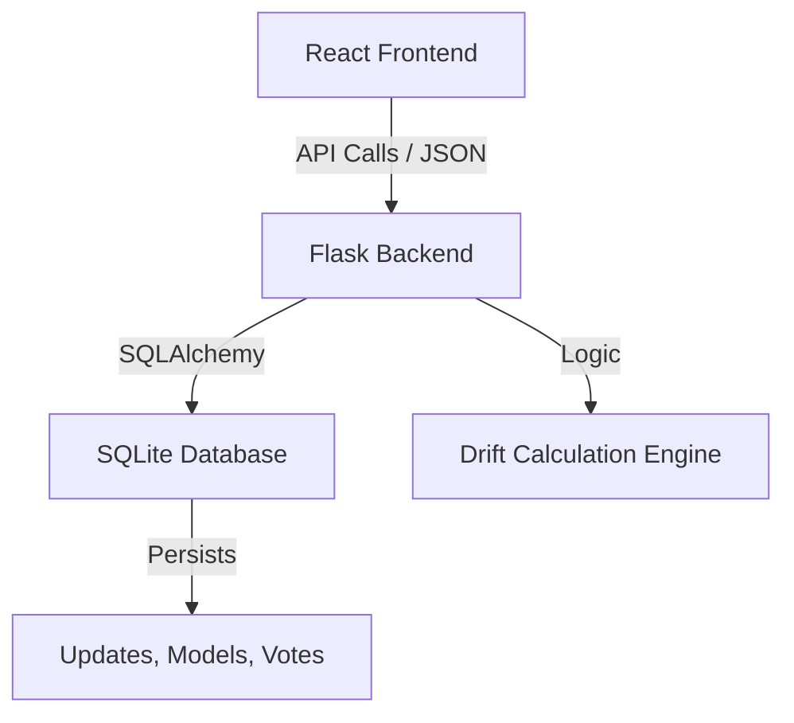

# DRIFT.AI — AI Knowledge Drift Detection Platform

DRIFT.AI is a sophisticated monitoring platform designed to detect, visualised, and mitigate **Knowledge Drift** in Large Language Models (LLMs). It combines a high-performance React frontend with a Python Flask backend to provide real-time intelligence on model degradation.

## 🏗️ Architecture



## 🌟 Features

- **Live Mission Control**: Real-time dashboard with critical drift metrics, average scores, and trend analysis.
- **Model Tracking**: Monitor specific LLMs (GPT-4o, Claude, etc.) with dynamic health statuses.
- **GenAI Updates**: Community-driven feed for the latest AI research and releases.
- **AI-Powered Drift Scoring**: Automated analysis of content to simulate knowledge drift detection (10-95%).
- **Persistence**: User-specific upvotes and custom model tracking stored in a SQLite database.
- **Data Portability**: One-click export of all drift updates to JSON format.

## 🚀 Getting Started

### Prerequisites
- Python 3.10+
- Node.js & npm

### One-Click Launch (Recommended)
If you are on Windows, you can start both the backend and frontend simultaneously:
```powershell
.\run_all.ps1
```

### Manual Setup

#### 1. Backend
```bash
cd Backend
pip install -r requirements.txt
python app.py
```
*Backend will run on `http://localhost:5000`*

#### 2. Frontend
```bash
cd drift-ai
npm install
npm run dev
```
*Frontend will run on `http://localhost:5173`*

## 🛠️ Technology Stack

- **Frontend**: React, Vanilla CSS, Vite.
- **Backend**: Python, Flask, Flask-CORS.
- **Database**: SQLite with SQLAlchemy ORM.
- **Aesthetics**: Glassmorphism, Space Grotesk typography, and dynamic CSS animations.

---
© 2025 Drift.AI — Advanced AI Monitoring Solutions
